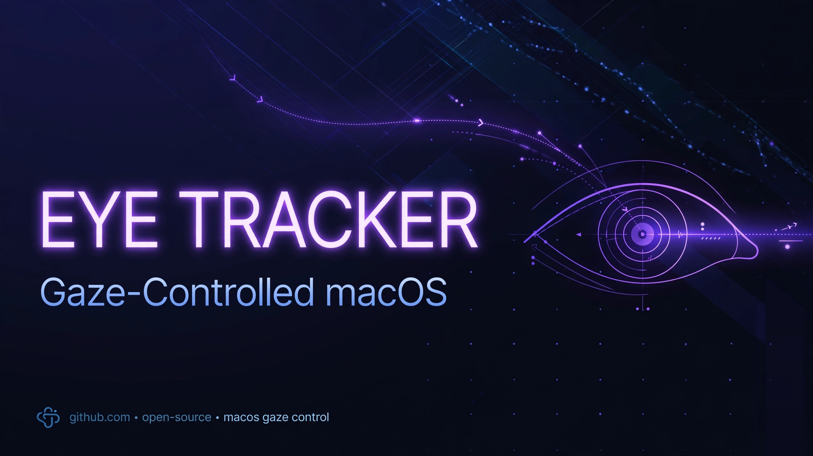

# EyeTracker

> ## Status: 🟢 Completed
>
> <progress value="85" max="100"></progress>
>
> **Progress: 85%** — Works end-to-end: camera capture, face/eye/pupil detection, gaze estimation, and cursor control. Remaining gap: calibration is manual (sliders); a fitted calibration routine is the next step.

<p align="center">
  
</p>


## What it is

EyeTracker is a native macOS app that estimates where you're looking using the built-in webcam and moves the mouse cursor accordingly — **all processing is local, no frames ever leave your Mac**. It detects the face, both eyes, and pupils with Apple's Vision framework, computes gaze direction from pupil offset relative to the eye corners (plus head yaw/pitch past a deadzone for reaching screen edges), smooths the estimate, and drives the cursor via CGEvent. A blink re-centers the baseline, and cursor control pauses for 3 seconds whenever you move the real mouse so the app never fights you.

## What works (verified)

- ✅ **Camera capture** — `GazeTracker.swift` drives an AVFoundation capture session (built-in, external, or Continuity camera), camera permission requested only when tracking starts.
- ✅ **Face/eye/pupil detection** — Vision framework landmarks: face box, both eye outlines, pupil dots, per-eye arrows showing pupil offset from centre, all rendered live over the camera preview.
- ✅ **Gaze estimation** — `GazeMath.swift` (pure math, testable): pupil offset from the line between the two eye corners, measured in eye widths. Corners are used rather than the eyelid outline because the eyelid closes over the pupil when looking down.
- ✅ **Head assist** — head yaw/pitch added past a deadzone; the eyes have limited travel, so head movement carries the cursor the rest of the way to screen edges.
- ✅ **Cursor control** — `CursorController.swift` moves the pointer via CGEvent, with exponential-moving-average smoothing.
- ✅ **Blink to re-center** — eye openness below threshold for two frames snaps the baseline back to centre using the last pre-blink sample.
- ✅ **Safety interlock** — cursor control pauses 3s whenever the physical mouse moves.
- ✅ **Privacy by design** — entitlements + Info.plist reviewed: camera frames are never uploaded, saved, or transmitted.

*Verified by: reading all Swift sources (`Sources/App`, `Sources/Tracker`, `Sources/Cursor`, `Sources/UI`), `project.yml`, and entitlements. Not compiled here — Swift/Xcode isn't available in this environment; no CI runs exist. Status per the repo's own docs: "Working end to end."*

## Tech stack

| Layer | Technology |
|---|---|
| Language | Swift 5.9 |
| UI | SwiftUI |
| Face/eye detection | Apple Vision framework |
| Cursor control | CGEvent |
| Build | XcodeGen (`project.yml`) → `.xcodeproj` |
| Platform | macOS 14.0+, Xcode 16+ |

## How to run

```bash
# Requires: macOS 14+, Xcode 16+, a webcam

cd EyeTracker
xcodegen generate
xcodebuild -project EyeTracker.xcodeproj -scheme EyeTracker -configuration Debug build
open ~/Library/Developer/Xcode/DerivedData/EyeTracker-*/Build/Products/Debug/EyeTracker.app

# Or simply: open EyeTracker.xcodeproj in Xcode and press Cmd+R
```

Grant camera permission when prompted — processing stays on your Mac.

## Screenshots

No screenshots in the repo. The app window shows a live camera preview with the detected face box, eye outlines, pupil dots, per-eye gaze arrows, and the raw numbers behind the estimate. The banner above is the generated visual.

## What you can add more

- [ ] **Fitted calibration routine** — replace the manual calibration sliders with a 5/9-point look-at-dots calibration that fits a mapping (the repo's own stated next step)
- [ ] **Dwell click** — trigger a click by holding gaze on a point for a configurable time
- [ ] **Per-app profiles** — different sensitivity/deadzone settings per application
- [ ] **Gaze heatmap** — record and visualize where you looked over a session
- [ ] **Menu-bar mode** — run headless in the menu bar without the preview window

## Project structure

```
EyeTracker/
├── project.yml                  # XcodeGen spec (bundle id, targets, settings)
├── Sources/
│   ├── App/
│   │   ├── EyeTrackerApp.swift       # App entry point
│   │   ├── Info.plist                # Bundle info, camera usage description
│   │   └── EyeTracker.entitlements   # Sandbox/camera entitlements
│   ├── Tracker/
│   │   ├── GazeTracker.swift         # Capture + Vision + gaze pipeline
│   │   └── GazeMath.swift            # Pure gaze math (testable)
│   ├── Cursor/
│   │   └── CursorController.swift    # CGEvent cursor control
│   └── UI/
│       ├── ContentView.swift         # Preview, overlay, tuning UI
│       └── CalibrationOverlay.swift  # Manual calibration sliders
├── Tests/
│   └── main.swift                     # Test entry
├── Resources/                         # (empty placeholder)
└── banner.webp                        # Project banner
```

---
*README written after code audit on 2026-10-08.*
